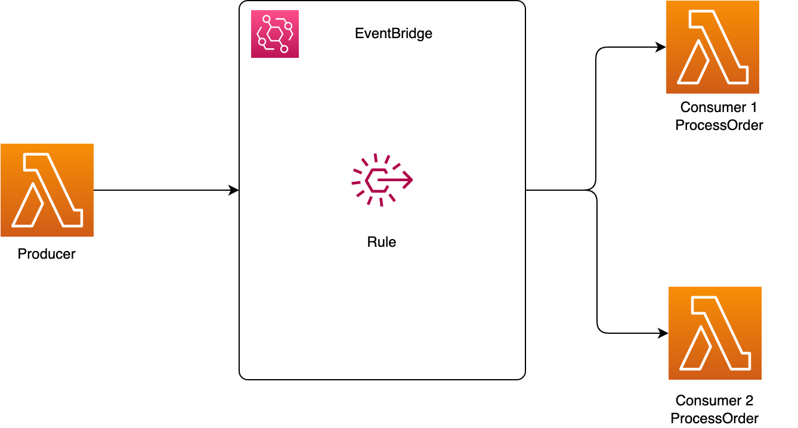
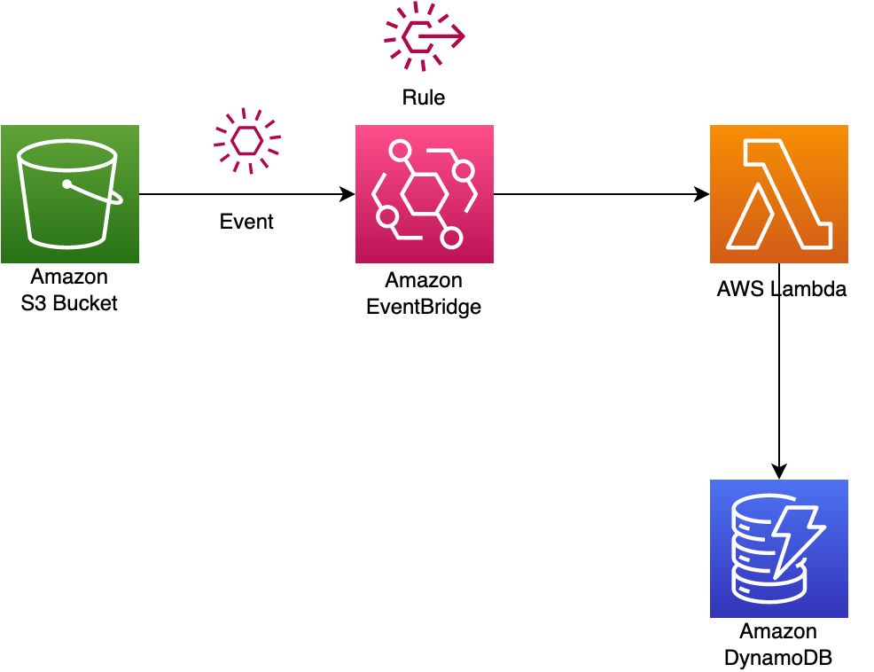

```bash
https://d2cvlmmg8c0xrp.cloudfront.net/EventBridgeS3Stack.template.json
```

## Introduction

This [GitHub](https://github.com/entest-hai/eventbridge-lambda) shows events format, how they are produced and consumed and how to create a rule and add targets. 

- Part 1 uses lambdas to produce and consume my-own events
- Part 2 creates a S3 rule with prefix.

## Part 1. Producer and Consumer

- A lambda procuder sends events to the event bus
- A lambda consumer being trigger by the event rule
- The event rule map the events to targets (the lamda consumer)
- [EventPattern](https://docs.aws.amazon.com/eventbridge/latest/userguide/eb-event-patterns.html) specify how to match events to targets
- Use amazon s3 event notification with amazon [eventbridge](https://aws.amazon.com/blogs/aws/new-use-amazon-s3-event-notifications-with-amazon-eventbridge/)




## Event Format

send/put an [event format](https://docs.aws.amazon.com/eventbridge/latest/userguide/eb-events.html) by python boto3. Detail field should be a JSON object, that's why json.dumps here, or JSON.stringfy in javascript.

```py
resp = eventClient.put_events(
  Entries=[
    {
      'Time': datetime.now(),
      'Source': 'io.entest.demo',
      'Detail': json.dumps({"title": "purchase event"}),
      'DetailType': 'purchase',
      'Resources':['arn:aws:lambda...']
    }
  ]
)
```

event rule uses [eventPattern](https://docs.aws.amazon.com/eventbridge/latest/userguide/eb-event-patterns.html) to map purchase-event to process purchase lambda

```tsx
const purchaseRule = new aws_events.Rule(this, 'TriggerProcessPurchaseLambda', {
  ruleName: 'TriggerProcessPurchaseLambda',
  description: '',
  eventPattern: { source: ['io.entest.demo'], detailType: ['purchase'] }
})

purchaseRule.addTarget(
  new aws_events_targets.LambdaFunction(processPurchaseLambda.lambda)
)
```

received event format in python

```json
{
  "version": "0",
  "id": "9b8aa069-94a8-2283-dcb0-0d3511df4345",
  "detail-type": "purchase",
  "source": "io.entest.demo",
  "account": "ACCOUNT_ID",
  "time": "2022-07-30T03:22:23Z",
  "region": "REGION",
  "resources": ["arn:aws:lambda..."],
  "detail": { "title": "purchase event" }
}
```

## CDK Stack

create lambda producer

```tsx
const producerLambda = new aws_lambda.Function(this, 'ProducerLambda', {
  functionName: 'ProducerLambda',
  code: aws_lambda.Code.fromInline(
    fs.readFileSync(path.join(__dirname, './../lambdas/producer.py'), {
      encoding: 'utf-8'
    })
  ),
  handler: 'index.handler',
  runtime: aws_lambda.Runtime.PYTHON_3_8,
  timeout: Duration.seconds(10)
})

producerLambda.addToRolePolicy(
  new PolicyStatement({
    effect: Effect.ALLOW,
    resources: ['*'],
    actions: ['events:PutEvents']
  })
)
```

create a lambda based construct for purchase and order services.

```tsx
export class LambdaService extends Construct {
  public readonly lambda: aws_lambda.Function

  constructor(scope: Construct, id: string, props: LambdaServiceProps) {
    super(scope, id)

    const func = new aws_lambda.Function(this, props.functionName, {
      functionName: props.functionName,
      code: aws_lambda.Code.fromInline(
        fs.readFileSync(path.join(__dirname, props.functionCode), {
          encoding: 'utf-8'
        })
      ),
      handler: 'index.handler',
      runtime: aws_lambda.Runtime.PYTHON_3_8,
      timeout: Duration.seconds(10),
      // provide a topic arn if want the consumer send sns
      environment: {
        TOPIC_ARN: props.topicArn ? props.topicArn : ''
      }
    })

    func.addToRolePolicy(
      new PolicyStatement({
        effect: Effect.ALLOW,
        resources: ['*'],
        actions: ['sns:*']
      })
    )

    this.lambda = func
  }
}
```

event rule map purchase-events to process purchase lambda

```tsx
const purchaseRule = new aws_events.Rule(this, 'TriggerProcessPurchaseLambda', {
  ruleName: 'TriggerProcessPurchaseLambda',
  description: '',
  eventPattern: { source: ['io.entest.demo'], detailType: ['purchase'] }
})

purchaseRule.addTarget(
  new aws_events_targets.LambdaFunction(processPurchaseLambda.lambda)
)
```

event rule map order-lambda to process order lambda

```tsx
const orderRule = new aws_events.Rule(this, 'TriggerProcessOrderLambda', {
  ruleName: 'TriggerProcessOrderLambda',
  description: '',
  eventPattern: { source: ['io.entest.demo'], detailType: ['order'] }
})

orderRule.addTarget(
  new aws_events_targets.LambdaFunction(processOrderLambda.lambda)
)
```

## Lambda Producer

```py
from datetime import datetime
import json
import boto3

eventClient = boto3.client('events')

def handler(event, context):
    """
    send event to enventbridge
    """
    request_body = event['body']
    print(request_body)
    resp = eventClient.put_events(
        Entries=[
            {
                'Time': datetime.now(),
                'Source': 'io.entest.demo',
                'Detail': json.dumps(request_body),
                'DetailType': 'service_status',
            }
        ]
    )
    print(resp)
    return (
        {
            'message': 'procuder'
        }
    )
```

## Lambda Consumer

```py
import os
import json
import boto3

snsClient = boto3.client('sns')

def handler(event, context):
    """
    consume event and send sns
    """
    # if an sns topic arn avaiable
    if (os.environ['TOPIC_ARN'] != ''):
        snsClient.publish(
            TopicArn=os.environ['TOPIC_ARN'],
            Message=json.dumps(event)
        )
    else:
        pass
    return {
        'message': event
    }

```

## Part 2. S3 Event Rule Prefix




before the eventbridge we s3 emit events and invoke lambdas as 
```tsx
 bucket.addEventNotification(
      cdk.aws_s3.EventType.OBJECT_CREATED,
      new cdk.aws_s3_notifications.LambdaDestination(func),
      {
        prefix: "onevent/",
      }
    );
```

event sent from S3 to EventBridge has a format as [below](https://docs.aws.amazon.com/AmazonS3/latest/userguide/ev-events.html)

```json
{
  "version": "0",
  "id": "17793124-05d4-b198-2fde-7ededc63b103",
  "detail-type": "Object Created",
  "source": "aws.s3",
  "account": "111122223333",
  "time": "2021-11-12T00:00:00Z",
  "region": "ca-central-1",
  "resources": ["arn:aws:s3:::DOC-EXAMPLE-BUCKET1"],
  "detail": {
    "version": "0",
    "bucket": {
      "name": "DOC-EXAMPLE-BUCKET1"
    },
    "object": {
      "key": "example-key",
      "size": 5,
      "etag": "b1946ac92492d2347c6235b4d2611184",
      "version-id": "IYV3p45BT0ac8hjHg1houSdS1a.Mro8e",
      "sequencer": "617f08299329d189"
    },
    "request-id": "N4N7GDK58NMKJ12R",
    "requester": "123456789012",
    "source-ip-address": "1.2.3.4",
    "reason": "PutObject"
  }
}
```

then we can a rule as

```tsx
const rule = new cdk.aws_events.Rule(this, "S3EventTriggerLambdaRule", {
      ruleName: "S3EventTriggerLambdaRule",
      eventPattern: {
        // source
        source: ["aws.s3"],

        // match filter
        detailType: ["Object Created"],
        detail: {
          bucket: {
            name: [bucket.bucketName],
          },
          object: {
            key: [{ prefix: "onrule/" }],
          },
        },
      },
    });
```

lookup an existed bucket

```tsx
const bucket = aws_s3.Bucket.fromBucketName(
  this,
  'S3BucketEventSource',
  props.bucketName
)

bucket.enableEventBridgeNotification()
```

lambda function to process the event

```tsx
const func = new aws_lambda.Function(this, 'ProcessEventS3PutObject', {
  functionName: 'ProcessEventS3PutObject',
  code: aws_lambda.Code.fromInline(
    fs.readFileSync(
      path.resolve(__dirname, './../lambdas/lambda_prefix_s3.py'),
      {
        encoding: 'utf-8'
      }
    )
  ),
  handler: 'index.main',
  runtime: aws_lambda.Runtime.PYTHON_3_8
})
```

then add a lambda as a target

```tsx
eventRule.addTarget(new aws_events_targets.LambdaFunction(func))
```

not forget to grant lambda to read s3

```tsx
table.grantReadWriteData(func);
bucket.grantReadWrite(func);
bucket.grantReadWrite(testLambda);
```

Note to use a lambda in the same region to put objects into the S3 bucket for testing purpose. It might not working if upload objects from a differnt retion. 


## Auto Scaling 

- No batch size configuration 
- S3 or EventBridge sends events to a Lambda internal queue 
- Lambda service process event (scale concurrency)

Generate data for uploading to s3 

```bash 
for x in {1..100}
do 
  touch data-$x.txt 
  echo 'hello' > data-$x.txt
done 
```

Then upload to s3 

```bash 
aws s3 cp . s3://eventbridge-demo-bucket-874056087589-1/onrule/ --exclude '*' --include '*.txt' --recursive 
```

Event format from onevent (not the EventBridge)

```json
{
  "eventVersion": "2.1",
  "eventSource": "aws:s3",
  "awsRegion": "ap-southeast-1",
  "eventTime": "2023-11-14T03:05:37.919Z",
  "eventName": "ObjectCreated:Put",
  "userIdentity": {
    "principalId": "AWS:AROA4XAONPAS7B37OMTOG:MasterKey"
  },
  "requestParameters": {
    "sourceIPAddress": "13.229.213.94"
  },
  "responseElements": {
    "x-amz-request-id": "H67ED4KTFBA4Y9GA",
    "x-amz-id-2": "H5hWyUQqa5hcXp1bidpr9Y22v8maQdoitdeJyY3yRpHMMaN+tTZ0wc4QZGyV8uvcfMuDRqACtAKJ9ECEsPJ+F/9gn9/nOh16"
  },
  "s3": {
    "s3SchemaVersion": "1.0",
    "configurationId": "ZmUyOGQ1N2ItYzI4OS00NGZhLTlkYTItYzQyODI3ZjZjZmJk",
    "bucket": {
      "name": "eventbridge-demo-bucket-874056087589-1",
      "ownerIdentity": {
        "principalId": "AXB12R7XLP26D"
      },
      "arn": "arn:aws:s3:::eventbridge-demo-bucket-874056087589-1"
    },
    "object": {
      "key": "onevent/data-50.txt",
      "size": 6,
      "eTag": "b1946ac92492d2347c6235b4d2611184",
      "sequencer": "006552E401DA1B168B"
    }
  }
}
```

Event from the onrule (EventBridge)

```json 
{
  "version": "0",
  "id": "dd955cee-1724-954b-0a81-7606ce6f69e6",
  "detail-type": "Object Created",
  "source": "aws.s3",
  "account": "874056087589",
  "time": "2023-11-14T03:11:00Z",
  "region": "ap-southeast-1",
  "resources": [
    "arn:aws:s3:::eventbridge-demo-bucket-874056087589-1"
  ],
  "detail": {
    "version": "0",
    "bucket": {
      "name": "eventbridge-demo-bucket-874056087589-1"
    },
    "object": {
      "key": "onrule/data-61.txt",
      "size": 6,
      "etag": "b1946ac92492d2347c6235b4d2611184",
      "sequencer": "006552E54464E6FB58"
    },
    "request-id": "5KCXJ3SCJ8BB7F2R",
    "requester": "874056087589",
    "source-ip-address": "13.229.213.94",
    "reason": "PutObject"
  }
}
```